<h1 align="center">Hi, I'm Calle 👋</h1>
<h3 align="center">Fullstack Developer &amp; FiveM Enthusiast</h3>

  I'm a fullstack developer who builds web apps and FiveM resources, with a soft spot for clean, fast developer tools. 
  My site is my portfolio and a home for the small utilities I build along the way.

  
  
  

---

### 🧰 Tech I work with

  
  
  
  
  
  
  

  
  
  
  
  

---

### 📊 Stats

  
  

  

---

### 📈 Activity

  

